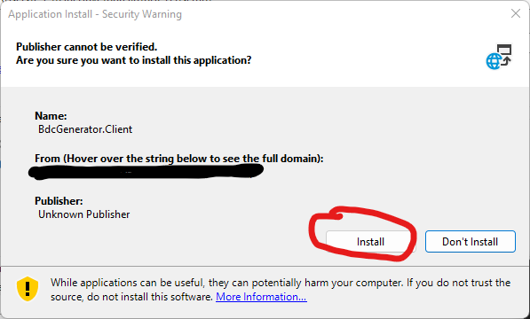
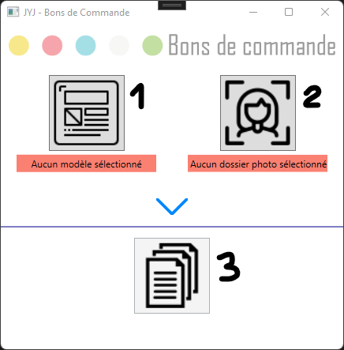
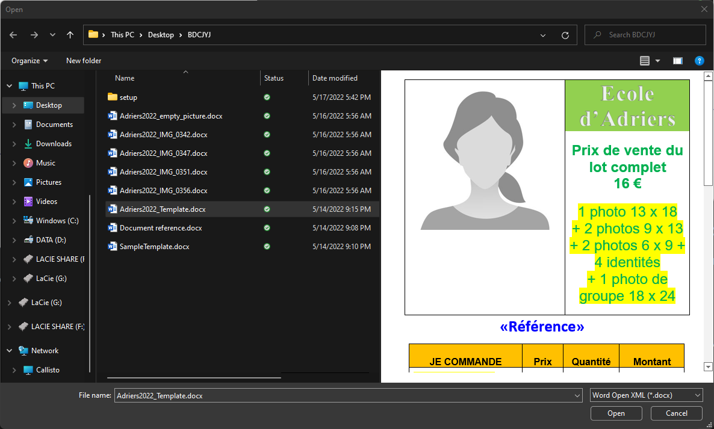
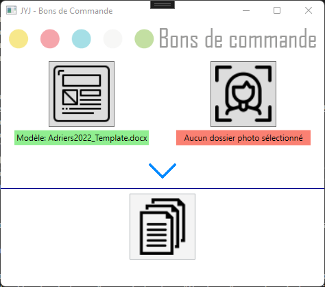
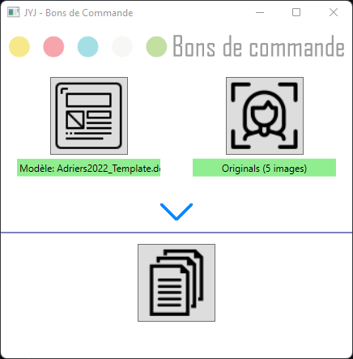
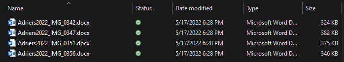

# BdcGenerator

# Intro
As this repository is only meant for solving a specific business case, the following documentation will be and stay in french.

# Installation

Pour installer l'application, il faut exécuter **Setup.exe**

Il est possible que Windows :
- demande confirmation car l'dentité de l'éditeur n'est pas confirmmée
- ait besoin d'accéder à internet pour terminer l'installation

# Utilisation
## Principe
1. Sélection du modèle de document (1 par école)
2. Sélection du dossier contenant les photos miniatures
3. Sélection du dossier de sortie + Génération des documents

## Sélection du modèle de document

Le modèle de document doit :
- être un fichier docx
- contenir un ContentControl Image ayant le tag "Picture"
- contenir un ContentControl Text  ayant le tag "Reference"

A savoir :
- les anciens modèles ne sont pas compatibles 
- la méthode la plus simple est surement de partir de l'exemple  "Adriers2022_Template.docx" et de faire les modifications propres aux différentes écoles
- l'autre méthode consiste à 
  1. partir d'un document vierge
  2. copier/coller le contenu d'un de tes modèles existant
  3. remplacer la photo par un ContentControl avec le tag Picture
  4. remplacer la référence par un ContentControl avec le tag Reference

  

## Sélection des miniatures

A savoir :
- les photos sont prises telles quelles et insérées dans le document, donc si la taille n'est pas celle attendue par le modèle, le résultat sera surprenant

## Génération des documents

Pour chaque photo trouvée dans le dossier des miniatures (photos de type .jpg ou .png), le generateur va :
- remplacer le "ContentControl Image" ayant le tag "Picture" par la photo miniature
- remplacer le "ContentControl Text" ayant le tag "Reference" par le nom de la photo

A savoir :
- Si le nom du modèle est du type XXXXXX_Template.docx, alors le nom des fichiers créés sera XXXXXX_NomPhoto.docx
- Un bon de commande est généré par photo (par opposition à un fichier contenant tous les bons de commande)

